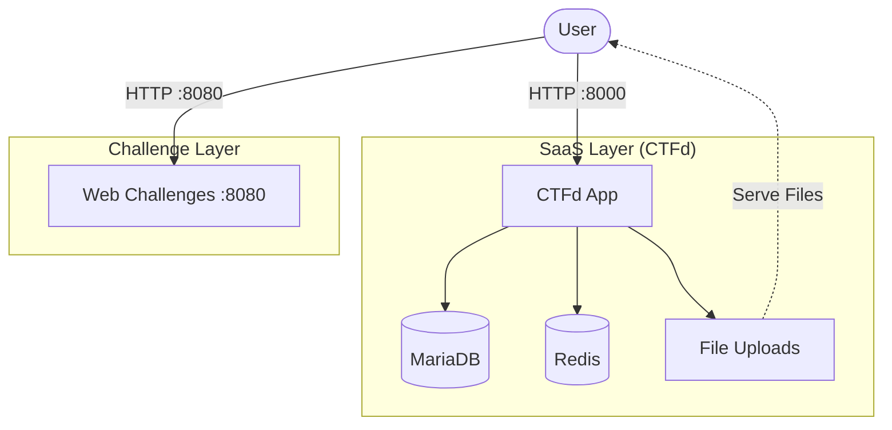

# Hyve CTF 2026 - System Logic & Integrations

This document details the internal mechanisms, API flows, and service integrations that power the Hyve CTF platform.

## 1. Automated Setup Flow (`setup_ctf.py`)

The `setup_ctf.py` script is the central orchestrator that automates the transition from a fresh Docker install to a fully configured CTF.

### API Orchestration
The script uses `requests` to interact with the CTFd API:
1. **Initial Setup**: Checks for the `/setup` endpoint. If found, it fetches the page, extracts the CSRF `nonce`, and submits a POST request to configure the admin account, event name ("Hyve CTF"), and timing.
2. **Authentication**: Performs a login to establish a session, then POSTs to `/api/v1/tokens` to generate a persistent **Admin API Token**.
3. **Team Creation**: Loops to create participant teams via `POST /api/v1/teams`, generating unique credentials for each.
4. **Challenge Import**: 
    *   Generates static challenge files locally (OSINT images, PCAPs, etc.) using `generate_team_files.py`.
    *   Triggers `import_challenges.py` which parses `challenges.yml`.
    *   Creates challenges via `POST /api/v1/challenges`.
    *   **Uploads Files**: Directly uploads the generated challenge files to CTFd via the `/api/v1/files` endpoint, associating them with their respective challenges.

## 2. Static Challenge Generation

To ensure consistency and simplify infrastructure, challenge files are generated statically before import.

### Asset Generation (`utils/generate_team_files.py`)
This script produces a single set of files in the `challenges/` directory:
1.  **OSINT**: Downloads a random landmark image (e.g., Eiffel Tower) and embeds GPS coordinates.
2.  **Steganography**: Creates a `cat.jpeg` with a hidden flag embedded via `steghide` and generates a corresponding wordlist.
3.  **Network**: Generates a PCAP file containing simulated traffic and a cleartext flag.
4.  **Crypto**: Creates a multi-layer Base64 encoded text file.

These files are then uploaded to CTFd, meaning all teams download the exact same file from the CTFd interface.

## 3. Service Mesh (Docker Integration)

The platform is split across two Docker Compose files connected by a shared network:
- **`ctfd_network`**: An external network created by the CTFd stack that allows the `challenge-web` service to be accessible.
- **Linkages**: 
    - `setup_ctf.py` -> `localhost:8001` (external access to CTFd)
    - `ctf-web-challenges` -> `ctfd_network` (isolated web challenges)

## 4. Visual Workflows

### System Architecture

## 5. Performance & Security Considerations

### Server Load Handling
*   **Container Resource Limits**: Each challenge container should have `cpus` and `memory` limits defined in `docker-compose.yml` to prevent a single exploited container from exhausting host resources.
*   **Gunicorn Workers**: CTFd runs with 4 Gunicorn workers by default. For higher load (100+ concurrent users), increase `WORKERS` in `docker-compose.yml` to `2 * CPU_CORES + 1`.

### Rate Limiting
1.  **Flag Submissions**: CTFd natively uses Redis to rate-limit flag submissions (default: 10 attempts per minute).
2.  **Web Challenges**: The Flask app (`app.py`) uses a single-threaded development server by default. For production, deploy behind `gunicorn` or `nginx` to handle concurrent connections gracefully.
